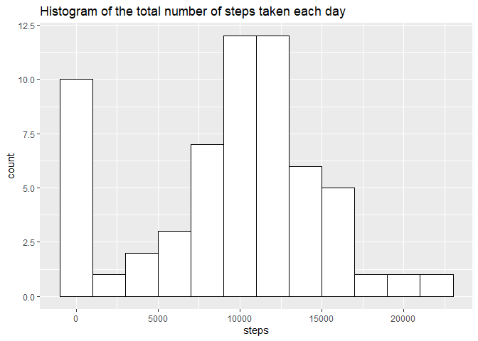
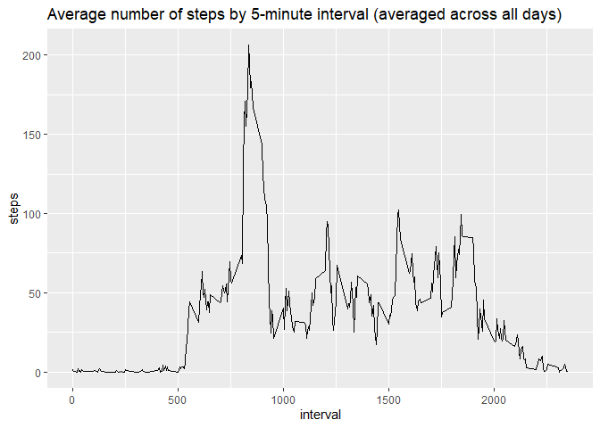
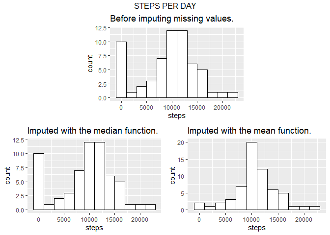
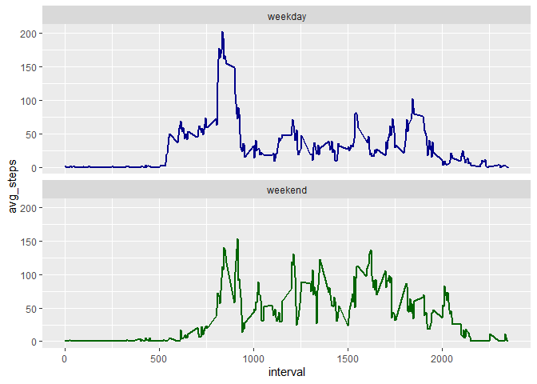

&nbsp;  
&nbsp;  
&nbsp;

# **WEEK 2 - PROJECT 1**

&nbsp;  
&nbsp;  
&nbsp;

  For this project, I'm going to use three **R packages** (the first two come from the **Tidyverse** set of packages): 
  
  1) **dplyr** for data management. 
  
  2) **ggplot2** for graphics. 
  
  3) **gridExtra** for graphics.

&nbsp; 


```r
library(dplyr)
library(ggplot2)
library(gridExtra)
```

&nbsp;  

The folder where this **R Markdown (\*.Rmd)** document is contained, which will be the **working directory**, must also contain the **activity.zip** document.

&nbsp; 


```r
getwd()
```

```
## [1] "C:/Users/Javier/Documents/Mis Documentos/COURSERA/DATA SCIENCE SPECIALIZATION/05 REPRODUCIBLE RESEARCH/WEEK 2/PROJECT/RepData_PeerAssessment1"
```


```r
dir()
```

```
##  [1] "activity.csv"       "activity.zip"       "doc"               
##  [4] "instructions_fig"   "PA1_template.html"  "PA1_template.md"   
##  [7] "PA1_template.Rmd"   "PA1_template_files" "README.md"         
## [10] "Rmd_Document.Rmd"
```

&nbsp;  
&nbsp;  
&nbsp;

## Loading and preprocessing the data

&nbsp;  

**1. Loading the data (i.e. read.csv()).**    


```r
unzip("activity.zip")
activity <- read.csv("activity.csv", header = TRUE)
```

&nbsp;  

**2. Processing/transforming the data (if necessary) into a format suitable for your analysis.** 

&nbsp; 

We can eye the **variables** of the dataset:

&nbsp; 


```r
names(activity)
```

```
## [1] "steps"    "date"     "interval"
```

&nbsp; 

And change their order:

&nbsp; 


```r
activity <- activity[, c(2, 3, 1)]
names(activity)
```

```
## [1] "date"     "interval" "steps"
```

&nbsp; 

Let's also observe the **class** or data type of this variables and some of their values:

&nbsp; 


```r
str(activity)
```

```
## 'data.frame':	17568 obs. of  3 variables:
##  $ date    : Factor w/ 61 levels "2012-10-01","2012-10-02",..: 1 1 1 1 1 1 1 1 1 1 ...
##  $ interval: int  0 5 10 15 20 25 30 35 40 45 ...
##  $ steps   : int  NA NA NA NA NA NA NA NA NA NA ...
```

```r
head(activity)
```

```
##         date interval steps
## 1 2012-10-01        0    NA
## 2 2012-10-01        5    NA
## 3 2012-10-01       10    NA
## 4 2012-10-01       15    NA
## 5 2012-10-01       20    NA
## 6 2012-10-01       25    NA
```

```r
tail(activity)
```

```
##             date interval steps
## 17563 2012-11-30     2330    NA
## 17564 2012-11-30     2335    NA
## 17565 2012-11-30     2340    NA
## 17566 2012-11-30     2345    NA
## 17567 2012-11-30     2350    NA
## 17568 2012-11-30     2355    NA
```

```r
set.seed(1)
s <- sample(1:nrow(activity), replace = FALSE, size = 10)
activity[sort(s), ]
```

```
##             date interval steps
## 1085  2012-10-04     1820   175
## 3543  2012-10-13      710    32
## 4665  2012-10-17      440     0
## 6538  2012-10-23     1645     0
## 10063 2012-11-04     2230    NA
## 11048 2012-11-08      835    12
## 11605 2012-11-10      700    NA
## 15779 2012-11-24     1850     0
## 15953 2012-11-25      920     0
## 16591 2012-11-27     1430   441
```

&nbsp; 

We can see that it is convenient to change the class of the **date variable** to be **date**.

&nbsp; 


```r
activity <- mutate(activity, date = as.Date(date, "%Y-%m-%d"))
str(activity)
```

```
## 'data.frame':	17568 obs. of  3 variables:
##  $ date    : Date, format: "2012-10-01" "2012-10-01" ...
##  $ interval: int  0 5 10 15 20 25 30 35 40 45 ...
##  $ steps   : int  NA NA NA NA NA NA NA NA NA NA ...
```

&nbsp;  
&nbsp;  
&nbsp;

## What is mean total number of steps taken per day?

&nbsp;  

For this part of the assignment, we are going to **ignore the missing values** in the dataset.

&nbsp;  

**1. Calculating the total number of steps taken per day.**

&nbsp; 


```r
steps_per_day <- activity %>% group_by(date) %>% summarize(steps = sum(steps, na.rm = TRUE))
steps_per_day
```

```
## # A tibble: 61 x 2
##    date       steps
##    <date>     <int>
##  1 2012-10-01     0
##  2 2012-10-02   126
##  3 2012-10-03 11352
##  4 2012-10-04 12116
##  5 2012-10-05 13294
##  6 2012-10-06 15420
##  7 2012-10-07 11015
##  8 2012-10-08     0
##  9 2012-10-09 12811
## 10 2012-10-10  9900
## # ... with 51 more rows
```

&nbsp;  

**2. Making a histogram of the total number of steps taken each day.**

&nbsp; 


```r
ggplot(steps_per_day, aes(x = steps)) +
        geom_histogram(binwidth = 2000, color = "black", fill = "white") +
        ggtitle("Histogram of the total number of steps taken each day")
```

<!-- -->

&nbsp;  

**3. Calculating and reporting the mean and median of the total number of steps taken per day**

&nbsp; 

The **mean** is **9354 steps** and the **median** is **10395 steps**:

&nbsp; 


```r
summary(steps_per_day$steps)
```

```
##    Min. 1st Qu.  Median    Mean 3rd Qu.    Max. 
##       0    6778   10395    9354   12811   21194
```

&nbsp;  
&nbsp;  
&nbsp;

## What is the average daily activity pattern?

&nbsp;  

**1. Making a time series plot (type="l") of the 5-minute interval (x-axis) and the average number of steps taken, averaged across all days (y-axis).**

&nbsp; 


```r
daily_pattern <- activity %>% group_by(interval) %>% summarize(steps = mean(steps, na.rm = TRUE))
ggplot(daily_pattern) + aes(x = interval, y = steps) + geom_line() +
    ggtitle("Average number of steps by 5-minute interval (averaged across all days)")
```

<!-- -->

&nbsp;  

**2. Which 5-minute interval, on average across all the days in the dataset, contains the maximum number of steps?**

&nbsp; 

The asked interval is the 104th of the list:

&nbsp; 


```r
m <- which.max(daily_pattern$steps)
m
```

```
## [1] 104
```

&nbsp; 

Corresponding to the **interval from minute 835 to minute 836**:

&nbsp; 


```r
daily_pattern$interval[m]
```

```
## [1] 835
```

&nbsp; 

That **maximum value** is of **206 steps**:

&nbsp; 


```r
daily_pattern[daily_pattern$steps == max(daily_pattern$steps), ]
```

```
## # A tibble: 1 x 2
##   interval steps
##      <int> <dbl>
## 1      835  206.
```

&nbsp; 

Or using **dplyr**:

&nbsp; 


```r
max_steps <- max(daily_pattern$steps)
daily_pattern %>% filter(steps == max_steps)
```

```
## # A tibble: 1 x 2
##   interval steps
##      <int> <dbl>
## 1      835  206.
```

&nbsp;  
&nbsp;  
&nbsp;

## Imputing missing values

&nbsp;  

Note that there are a number of days/intervals where there are missing values (coded as NA). The presence of missing days may introduce bias into some calculations or summaries of the data.

&nbsp;
 
**1.  Calculating and reporting the total number of missing values in the dataset (i.e. the total number of rows with NAs)**

&nbsp; 

There are **2304 missing values** in the dataset:

&nbsp; 


```r
sum(is.na(activity))
```

```
## [1] 2304
```

&nbsp; 

They are all along the 'steps' column:

&nbsp; 


```r
colSums(is.na(activity))
```

```
##     date interval    steps 
##        0        0     2304
```

&nbsp;

**2. Devising a strategy for filling in all of the missing values in the dataset: I'll use the median/mean (along all days) for each 5-minute interval.**

&nbsp;

If we group by date, we can see that there are exactly 8 dates with missing values in the 'steps' column, and that all of the values in that 'steps' column are missing for those 8 dates:

&nbsp; 


```r
nas_per_date <- activity %>% group_by(date) %>%
        summarise(nas = sum(is.na(steps)), num_of_intervals = n())
nas_per_date
```

```
## # A tibble: 61 x 3
##    date         nas num_of_intervals
##    <date>     <int>            <int>
##  1 2012-10-01   288              288
##  2 2012-10-02     0              288
##  3 2012-10-03     0              288
##  4 2012-10-04     0              288
##  5 2012-10-05     0              288
##  6 2012-10-06     0              288
##  7 2012-10-07     0              288
##  8 2012-10-08   288              288
##  9 2012-10-09     0              288
## 10 2012-10-10     0              288
## # ... with 51 more rows
```

```r
table(nas_per_date$nas)
```

```
## 
##   0 288 
##  53   8
```

```r
dates_with_nas <- nas_per_date %>% filter(nas > 0)
dates_with_nas
```

```
## # A tibble: 8 x 3
##   date         nas num_of_intervals
##   <date>     <int>            <int>
## 1 2012-10-01   288              288
## 2 2012-10-08   288              288
## 3 2012-11-01   288              288
## 4 2012-11-04   288              288
## 5 2012-11-09   288              288
## 6 2012-11-10   288              288
## 7 2012-11-14   288              288
## 8 2012-11-30   288              288
```

&nbsp; 

If we group by interval, we can see that each of them has exactly 8 missing values (corresponding to the 8 dates from the last code chunk).

&nbsp; 


```r
nas_per_interval <- activity %>% group_by(interval) %>%
                    summarise(nas = sum(is.na(steps)), num_of_dates = n())
nas_per_interval
```

```
## # A tibble: 288 x 3
##    interval   nas num_of_dates
##       <int> <int>        <int>
##  1        0     8           61
##  2        5     8           61
##  3       10     8           61
##  4       15     8           61
##  5       20     8           61
##  6       25     8           61
##  7       30     8           61
##  8       35     8           61
##  9       40     8           61
## 10       45     8           61
## # ... with 278 more rows
```

```r
table(nas_per_interval$nas)
```

```
## 
##   8 
## 288
```

```r
nas_per_interval %>% filter(nas > 0)
```

```
## # A tibble: 288 x 3
##    interval   nas num_of_dates
##       <int> <int>        <int>
##  1        0     8           61
##  2        5     8           61
##  3       10     8           61
##  4       15     8           61
##  5       20     8           61
##  6       25     8           61
##  7       30     8           61
##  8       35     8           61
##  9       40     8           61
## 10       45     8           61
## # ... with 278 more rows
```

&nbsp;

I'm going to define a function with the value of an interval as argument and the median (or the mean) along all days as outcome.

&nbsp; 


```r
median_interval <- function(n) {
    my_steps <- activity %>% filter(interval == n)
    median(my_steps$steps, na.rm = TRUE)
}

mean_interval <- function(n) {
    my_steps <- activity %>% filter(interval == n)
    mean(my_steps$steps, na.rm = TRUE)
}
```


```r
u <- unique(activity$interval)
u
```

```
##   [1]    0    5   10   15   20   25   30   35   40   45   50   55  100  105
##  [15]  110  115  120  125  130  135  140  145  150  155  200  205  210  215
##  [29]  220  225  230  235  240  245  250  255  300  305  310  315  320  325
##  [43]  330  335  340  345  350  355  400  405  410  415  420  425  430  435
##  [57]  440  445  450  455  500  505  510  515  520  525  530  535  540  545
##  [71]  550  555  600  605  610  615  620  625  630  635  640  645  650  655
##  [85]  700  705  710  715  720  725  730  735  740  745  750  755  800  805
##  [99]  810  815  820  825  830  835  840  845  850  855  900  905  910  915
## [113]  920  925  930  935  940  945  950  955 1000 1005 1010 1015 1020 1025
## [127] 1030 1035 1040 1045 1050 1055 1100 1105 1110 1115 1120 1125 1130 1135
## [141] 1140 1145 1150 1155 1200 1205 1210 1215 1220 1225 1230 1235 1240 1245
## [155] 1250 1255 1300 1305 1310 1315 1320 1325 1330 1335 1340 1345 1350 1355
## [169] 1400 1405 1410 1415 1420 1425 1430 1435 1440 1445 1450 1455 1500 1505
## [183] 1510 1515 1520 1525 1530 1535 1540 1545 1550 1555 1600 1605 1610 1615
## [197] 1620 1625 1630 1635 1640 1645 1650 1655 1700 1705 1710 1715 1720 1725
## [211] 1730 1735 1740 1745 1750 1755 1800 1805 1810 1815 1820 1825 1830 1835
## [225] 1840 1845 1850 1855 1900 1905 1910 1915 1920 1925 1930 1935 1940 1945
## [239] 1950 1955 2000 2005 2010 2015 2020 2025 2030 2035 2040 2045 2050 2055
## [253] 2100 2105 2110 2115 2120 2125 2130 2135 2140 2145 2150 2155 2200 2205
## [267] 2210 2215 2220 2225 2230 2235 2240 2245 2250 2255 2300 2305 2310 2315
## [281] 2320 2325 2330 2335 2340 2345 2350 2355
```


```r
c1 <- cbind(interval = u, median = sapply(u, median_interval))
c2 <- cbind(interval = u, mean = sapply(u, mean_interval))
```


```r
as_tibble(c1)
```

```
## # A tibble: 288 x 2
##    interval median
##       <int>  <int>
##  1        0      0
##  2        5      0
##  3       10      0
##  4       15      0
##  5       20      0
##  6       25      0
##  7       30      0
##  8       35      0
##  9       40      0
## 10       45      0
## # ... with 278 more rows
```

```r
as_tibble(c2)
```

```
## # A tibble: 288 x 2
##    interval   mean
##       <dbl>  <dbl>
##  1        0 1.72  
##  2        5 0.340 
##  3       10 0.132 
##  4       15 0.151 
##  5       20 0.0755
##  6       25 2.09  
##  7       30 0.528 
##  8       35 0.868 
##  9       40 0     
## 10       45 1.47  
## # ... with 278 more rows
```

&nbsp; 

**3. Creating a new dataset that is equal to the original dataset but with the missing data filled in.**

&nbsp; 

Choosing the median function to fill in the dataset:

&nbsp; 


```r
activity.1 <- activity %>% mutate(steps = ifelse(is.na(steps), median_interval(interval), steps))
```

&nbsp;

We can verify that there is now no missing value in it:


```r
sum(is.na(activity))
```

```
## [1] 2304
```

```r
sum(is.na(activity.1))
```

```
## [1] 0
```

&nbsp; 

The same with the mean function:

&nbsp; 


```r
activity.2 <- activity %>% mutate(steps = ifelse(is.na(steps), mean_interval(interval), steps))
```

&nbsp; 


```r
sum(is.na(activity.2))
```

```
## [1] 0
```

&nbsp; 

**4. Making a histogram of the total number of steps taken each day and calculate and report the mean and median total number of steps taken per day. Do these values differ from the estimates from the first part of the assignment? What is the impact of imputing missing data on the estimates of the total daily number of steps?**

&nbsp;


```r
p  <- ggplot(steps_per_day, aes(x = steps)) +
          geom_histogram(binwidth = 2000, color = "black", fill = "white") +
          ggtitle("Before imputing missing values.")

steps_per_day.1 <- activity.1 %>% group_by(date) %>% summarise(steps = sum(steps))
p1 <- ggplot(steps_per_day.1, aes(x = steps)) +
          geom_histogram(binwidth = 2000, color = "black", fill = "white") +
          ggtitle("Imputed with the median function.")

steps_per_day.2 <- activity.2 %>% group_by(date) %>% summarise(steps = sum(steps))
p2 <- ggplot(steps_per_day.2, aes(x = steps)) +
          geom_histogram(binwidth = 2000, color = "black", fill = "white") +
          ggtitle("Imputed with the mean function.")

lay <- rbind(c(NA, 1, 1, NA), c(NA, 1, 1, NA), c(2, 2, 3, 3), c(2, 2, 3, 3))
grid.arrange(grobs = list(p, p1, p2), layout_matrix = lay, top = "STEPS PER DAY")
```

<!-- -->

Although the distribution before the imputing and after it with the median function look the same, they are not equal:


```r
identical(steps_per_day, steps_per_day.1)
```

```
## [1] FALSE
```

&nbsp; 

Nevertheless, this imputing does preserve both the median and the mean dataset values, not so the mean-imputing, which increments both of them:

&nbsp; 


```r
summary(steps_per_day$steps)
```

```
##    Min. 1st Qu.  Median    Mean 3rd Qu.    Max. 
##       0    6778   10395    9354   12811   21194
```

```r
summary(steps_per_day.1$steps)
```

```
##    Min. 1st Qu.  Median    Mean 3rd Qu.    Max. 
##       0    6778   10395    9354   12811   21194
```

```r
summary(steps_per_day.2$steps)
```

```
##    Min. 1st Qu.  Median    Mean 3rd Qu.    Max. 
##      41    9819   10766   10766   12811   21194
```

&nbsp;  
&nbsp;  
&nbsp;

## Are there differences in activity patterns between weekdays and weekends?

&nbsp;

For this part the weekdays() function may be of some help here. I'll use the dataset with the median-filled-in missing values (named 'activity.1') for this part.

&nbsp;

**1. Creating a new factor variable in the dataset with two levels, "weekday" and "weekend", indicating whether a given date is a weekday or weekend day.**

&nbsp;


```r
activity.3 <- activity.1 %>% mutate(day = as.factor(weekdays(date))) %>%
                             mutate(labor = ifelse(day %in% weekend, "weekend", "weekday")) %>%
                             mutate(labor = as.factor(labor))
as_tibble(activity.3)
```

```
## # A tibble: 17,568 x 5
##    date       interval steps day    labor  
##    <date>        <int> <dbl> <fct>  <fct>  
##  1 2012-10-01        0     0 Monday weekday
##  2 2012-10-01        5     0 Monday weekday
##  3 2012-10-01       10     0 Monday weekday
##  4 2012-10-01       15     0 Monday weekday
##  5 2012-10-01       20     0 Monday weekday
##  6 2012-10-01       25     0 Monday weekday
##  7 2012-10-01       30     0 Monday weekday
##  8 2012-10-01       35     0 Monday weekday
##  9 2012-10-01       40     0 Monday weekday
## 10 2012-10-01       45     0 Monday weekday
## # ... with 17,558 more rows
```

&nbsp;

**2. Making a panel plot containing a time series plot (i.e. type="l") of the 5-minute interval (x-axis) and the average number of steps taken, averaged across all weekday days or weekend days (y-axis).**

&nbsp;


```r
new_daily_pattern <- activity.3 %>% group_by(labor, interval) %>%
                                 summarise(avg_steps = mean(steps, na.rm = TRUE))

ggplot(new_daily_pattern) +
        aes(x = interval, y = avg_steps, color = labor) +
        geom_line(size = 1) +
        scale_colour_manual(values = c(weekday = "dark blue", weekend = "dark green")) +
        facet_wrap(~ labor, ncol = 1) +
        theme(legend.position = "none")
```

<!-- -->

&nbsp; 
&nbsp; 
&nbsp; 
&nbsp; 
&nbsp; 

